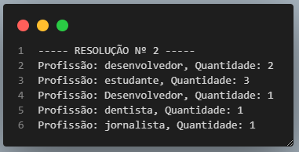

<h1 align="center">ATIVIDADES DESENVOLVIDAS NO CURSO DA ACADEMIA DO FLUTTER</h1>

<p align="center"> MÓDULO CONCLUÍDO COM ÊXITO.</p>

<p align="center">


</p>


## Principais recursos estudados

### FUNDAMENTOS

- Variaveis (nome, tipagem, inferência, camelcase, snackcase);
- Modificadores: final e const;
- Operadores condicionais (if, else);
- Operadores relacionais : == (Igualdade), != (Diferença), > (Maior que), < (Menor que), <= (Menor ou igual), >= (Maior ou igual);
- Operadores lógicos: && (E), || (OU), ! (não);
- Operador ternário: Uma simplificação do if\else ;
- Switch
- Null safety;
- Null Ware Operator (??);
- Conditional Property Access;
- Listas;
- Listas com Nullsafety;
- Idex;
- Utilizando os métodos: .length, .toString, .insert, .add, .addAll, .removeWhere, .firstWhere., .lastWhere, List.generate, .fold;
- Spred Operator;
- Colection if;
- Colection for;
- Uso do for;
- Uso do for in;
- Break dentro do for e for in;
- While e Do while;
- Iterable: takeWhile, Where, SkipWhile e Map;
- Convensões e manipulações de strings: Substring, Interpolação, Split;
- Manipulação de Números: toString, isEven, isOdd, isNegative, roundToDouble, int.Parse, double.Parse, tryParse.
- Detalhe sobre a String
- A String é composta por 4 campos (Nome|Idade|Profissão|Estado onde mora);


```
  final pacientes = [
    'Rodrigo Rahman|35|desenvolvedor|SP',
    'Manoel Silva|12|estudante|MG',
    'Joaquim Rahman|18|estudante|SP',
    'Fernando Verne|35|estudante|MG',
    'Gustavo Silva|40|desenvolvedor|MG',
    'Sandra Silva|40|Desenvolvedor|MG',
    'Regina Verne|35|dentista|MG',
    'João Rahman|55|jornalista|SP',
  ];
```  
### **DESAFIO:** Baseado no array acima monte um relatório onde:
  - 1 - Apresente os pacientes com mais de 20 anos e print o nome deles
  - 2 - Apresente quantos pacientes existem para cada profissão (desenvolvedor, estudante, dentista, jornalista)
  - 3 - Apresente a quantidade de pacientes que moram em SP

### RESOLUÇÃO
```
print('1 - Apresente os pacientes com mais de 20 anos e print o nome deles');

  for (var paciente in pacientes) {
    var dadosPaciente = paciente.split('|');
    var nomes = dadosPaciente[0];
    var idade = int.parse(dadosPaciente[1]);
    if (idade > 20) {
     
    print('Nome: $nomes Idade: $idade');
    }
  }
```
<p align="center">

</p>

```
print('2 - Apresente quantos pacientes existem para cada profissão (desenvolvedor, estudante, dentista');

var profissoes = [];

  for (var paciente in pacientes) {
    final dadosPaciente = paciente.split('|');
    final profissao = dadosPaciente[2];

    var profissaoIndex =
        profissoes.indexWhere((profissaoInfo) => profissaoInfo[0] == profissao);
    if (profissaoIndex == -1) {
      profissoes.add([profissao, 1]);
    } else {
      profissoes[profissaoIndex][1]++;
    }
  }
  
  profissoes.forEach((profissaoInfo) {
    var profissaoNome = profissaoInfo[0];
    var profissaoQuantidade = profissaoInfo[1];
    
    print('Profissão: $profissaoNome, Quantidade: $profissaoQuantidade');
  });
```
<p align="center">

</p>

```
print('3 - Apresente a quantidade de pacientes que moram em SP');

var estadosDoBrasil = [];

  for (var paciente in pacientes) {
    var dadosPacientes = paciente.split('|');
    var estados = dadosPacientes[3];

    var estadosIndex =
        estadosDoBrasil.indexWhere((estadosInfo) => estadosInfo[0] == estados);

    if (estadosIndex == -1) {
      estadosDoBrasil.add([estados, 1]);
    } else {
      estadosDoBrasil[estadosIndex][1]++;
    }
  }

  estadosDoBrasil.forEach((estadosInfo) {
    var estadosNome = estadosInfo[0];
    var estadoQuantidade = estadosInfo[1];
    print('Estado : $estadosNome » Qtd $estadoQuantidade');
  });
```
<p align="center">

</p>

### Autor


[](https://www.linkedin.com/in/luizzlcs/)
